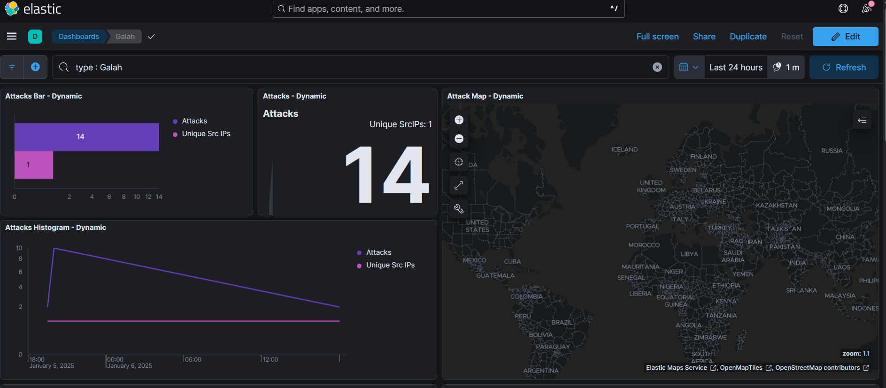

# TPotCE Honeypot Report

**Rohan Khandelwal - 220905143**

**Anandita Ranjan - REGNO** 

## Table of Contents

- [Table of Contents](#table-of-contents)
- [Abstract](#abstract)
- [Introduction](#introduction)
- [Background](#background)
  - [TPot-CE](#tpot-ce)
  - [Beelzebub](#beelzebub)
  - [Galah](#galah)
- [System Requirements](#system-requirements)
  - [TPot-CE](#tpot-ce-1)
  - [Ollama](#ollama)
- [Infrastructure](#infrastructure)
- [Installation and Setup](#installation-and-setup)
  - [Choose your distro](#choose-your-distro)
  - [Get and install T-Pot](#get-and-install-t-pot)
  - [Ollama installation](#ollama-installation)
  - [Further Setup](#further-setup)
- [Testing](#testing)
  - [Beelzebub](#beelzebub-1)
  - [Galah](#galah-1)
- [Key Insights](#key-insights)
- [Limitations](#limitations)
  - [Technical Limitations](#technical-limitations)
  - [Security Risks](#security-risks)
- [Conclusion](#conclusion)

## Abstract

This report outlines the Proof of Concept (POC) for deploying a
honeypot infrastructure using T-PotCE and integrating Large Language
Models (LLMs) to dynamically adjust honeypot configurations. The goal is
to demonstrate how LLMs can enhance honeypot adaptability by analyzing
logs, identifying potential threats, and implementing real-time
configuration changes.

## Introduction

**In cybersecurity honeypots are decoy servers or systems that are
deployed next to systems an organization uses for production**.
Honeypots are designed to look like attractive targets, and they get
deployed to allow IT teams to monitor the system's security responses
and to redirect the attacker away from their intended target.

**Combining Honeypots with Large Language Models (LLMs)**

 LLM-Based Honeypots mark the beginning of a game change for the
deception / honeypot field. Consequently, starting with the release
of **T-Pot 24.04.1**, two LLM-based
honeypots, **Beelzebub** and **Galah**, have been introduced in T-Pot.

By leveraging LLMs, honeypots can dynamically adapt to attackers\'
behaviour, generating realistic responses, modifying configurations like
port settings, and adjusting network structures on-the-fly. This
capability not only enhances deception but also enables more
sophisticated data analysis, providing actionable insights to security
teams.

## Background

### TPot-CE

T-Pot is the all in one, optionally distributed, multiarch honeypot
plattform, supporting 20+ honeypots and countless visualization options
using the Elastic Stack, animated live attack maps and lots of security
tools to further improve the deception experience.

### Beelzebub

Beelzebub is an advanced honeypot framework designed to provide a highly
secure environment for detecting and analyzing cyber-attacks. It offers
a low code approach for easy implementation and **uses AI to mimic the
behavior of a high-interaction SSH honeypot.**

### Galah

Galah is an **LLM-powered web honeypot** designed to mimic various
applications and dynamically respond to arbitrary HTTP requests

Unlike traditional web honeypots that manually emulate specific web
applications or vulnerabilities, Galah dynamically crafts relevant
responses---including HTTP headers and body content---to any HTTP
request.

## System Requirements

### TPot-CE

- A system or virtual machine with: At least 2 CPUs.

- 8GB RAM.

- 20GB disk space.

- Compatible Linux Distro.

### Ollama

- 8GB RAM

- 10GB Disk Space

- Intel/AMD CPU supporting AVX512

- Modern Graphics Card

## Infrastructure

1. Host Machine (to run Ollama)

2. VM (to run TPot)

## Installation and Setup

### Choose your distro

1. Download one of the supported Linux distro images and install it in a VM.
2. During installation choose a **minimum**, **netinstall** or **server** version that will only install essential packages.
3. **Never** install a graphical desktop environment such as Gnome or KDE. T-Pot will fail to work with it due to port conflicts. 
4. Make sure to install SSH, so you can connect to the machine remotely.

| Distribution Name                                                                  | x64                                                                                                                                   | arm64                                                                                                                                   |
| :--------------------------------------------------------------------------------- | :------------------------------------------------------------------------------------------------------------------------------------ | :-------------------------------------------------------------------------------------------------------------------------------------- |
| [Alma Linux OS 9.5 Boot ISO](https://almalinux.org)                                | [download](https://repo.almalinux.org/almalinux/9.5/isos/x86_64/AlmaLinux-9.5-x86_64-boot.iso)                                        | [download](https://repo.almalinux.org/almalinux/9.5/isos/aarch64/AlmaLinux-9.5-aarch64-boot.iso)                                        |
| [Debian 12 Network Install](https://www.debian.org/CD/netinst/index.en.html)       | [download](https://cdimage.debian.org/debian-cd/current/amd64/iso-cd/debian-12.9.0-amd64-netinst.iso)                                 | [download](https://cdimage.debian.org/debian-cd/current/arm64/iso-cd/debian-12.9.0-arm64-netinst.iso)                                   |
| [Fedora Server 41 Network Install](https://fedoraproject.org/server/download)      | [download](https://download.fedoraproject.org/pub/fedora/linux/releases/41/Server/x86_64/iso/Fedora-Server-netinst-x86_64-41-1.4.iso) | [download](https://download.fedoraproject.org/pub/fedora/linux/releases/41/Server/aarch64/iso/Fedora-Server-netinst-aarch64-41-1.4.iso) |
| [OpenSuse Tumbleweed Network Image](https://get.opensuse.org/tumbleweed/#download) | [download](https://download.opensuse.org/tumbleweed/iso/openSUSE-Tumbleweed-NET-x86_64-Current.iso)                                   | [download](https://download.opensuse.org/ports/aarch64/tumbleweed/iso/openSUSE-Tumbleweed-NET-aarch64-Current.iso)                      |
| [Rocky Linux OS 9.5 Boot ISO](https://rockylinux.org/download)                     | [download](https://download.rockylinux.org/pub/rocky/9/isos/x86_64/Rocky-9.5-x86_64-minimal.iso)                                      | [download](https://download.rockylinux.org/pub/rocky/9/isos/aarch64/Rocky-9.5-aarch64-minimal.iso)                                      |
| [Ubuntu 24.04.1 Live Server](https://ubuntu.com/download/server)                   | [download](https://releases.ubuntu.com/24.04/ubuntu-24.04.1-live-server-amd64.iso)                                                    | [download](https://cdimage.ubuntu.com/releases/24.04/release/ubuntu-24.04.1-live-server-arm64.iso)                                      |

 

### Get and install T-Pot
1. Clone this GitHub repository
2. Change into the **tpotce/** folder: `$ cd tpotce`
3. Run the installer as non-root: `$ ./install.sh`:
4. Follow the installer instructions, you will have to enter your user (`sudo` or `root`) password at least once
5. **Select the LLM option** during the installation to ensure that Beelzebub
and Galah are installed.
1. Check the installer messages for errors and open ports that might cause port conflicts
2. Reboot: `$ sudo reboot`
  

### Ollama installation

1. Ollama needs to be installed on the host device to ensure it utilizes
the GPU to offer the best performance. [Download Ollama](https://ollama.com/download/windows)

2. In a command prompt, run `ollama run llama3.2:3b`. This is a lightweight
model with only 3B tokens that allows for quick but simple honeypot
responses. This command will automatically download and install the
model.

3. Then, use `SET OLLAMA_HOST \<your IP address\>:\<port\>` to the host
machine's relevant port.

4. Finally, run the command `ollama serve` to start the server and handle
requests.
  

5. Verify if the server is accessible from the VM, by visiting the link in
a browser.
  

### Further Setup

1. Once the correct model is installed and Ollama is properly setup, modify
the *.env* file in the *tpotce* folder.
  

2. Restart the tpot service with *sudo systemctl restart tpot.service* to
enable the new configurations.

## Testing

**IP Addresses**
1.  Host: 192.168.1.97

2.  VM: 192.168.1.62

**Ports**

1.  Host

    a.  Ollama: 11434

2.  VM

    a.  T-Pot WebUI: 64297

    b.  Beelzebub SSH: 22

    c.  Galah HTTP: 80, 443, 8080, 8443

### Beelzebub

1. To test Beelzebub, connect to the VM using a SSH connection.
  

2. You can view the Beelzebub logs using *./doc/er logs beelzebub*.
  

3. Ollama logs are also visible in the Host Command Line
  

4. The T-Pot Kibana from the WebUI shows events and insights in an
organized manner
  
  

### Galah

1. To test Galah, visit any path for the above mentioned ports in a
browser.
  

2. Logs are visible in the VM
  

3. Attack Information can be viewed from the WebUI
  
  
  

## Key Insights

Current LLM and honeypot technologies do not allow us to dynamically
change ports, modify the structure or settings. However, they do allow
us to dynamically generate content for attackers to access while
receiving actionable information about the threat.

## Limitations

### Technical Limitations

- The quality of analysis and recommendations depends heavily on the
  LLM's training and context understanding.

- Real-time analysis might be delayed if logs are extensive or LLM
  responses are slow.

- LLMs may misinterpret logs, leading to incorrect configuration
  changes.

- Running both T-PotCE and an LLM in resource-constrained environments
  can affect performance.

### Security Risks

- Misconfigurations introduced by automated scripts could
  unintentionally weaken the honeypot's defences.

- Logs sent to external LLMs may contain sensitive information, risking
  exposure if not handled securely.

## Conclusion

This proof of concept illustrates the potential of integrating LLMs with
honeypot platforms to bolster threat detection capabilities and improve
adaptive responses to cyberattacks. The use of LLMs enables dynamic
generation of honeypot content that allows a more believable experience
for threat actors. By automating these adjustments, organizations can
stay ahead of attackers by rapidly adapting to new tactics, reducing
reaction times, and minimizing vulnerabilities in the system.

Despite the promising advantages, there are challenges such as
dependency on the LLM\'s accuracy and potential resource constraints in
high-traffic scenarios. Future refinements, including fine-tuning LLMs
on cybersecurity-specific datasets and integrating them with real-time
streaming log analysis, could further enhance system efficiency. These
advancements position LLM-augmented honeypots as an innovative and
practical tool for modern cybersecurity infrastructures. Furthermore,
although the honeypots observed above mark a major step in honeypot
development, they still offer very basic features such as SSH emulation
and HTTP responses.
